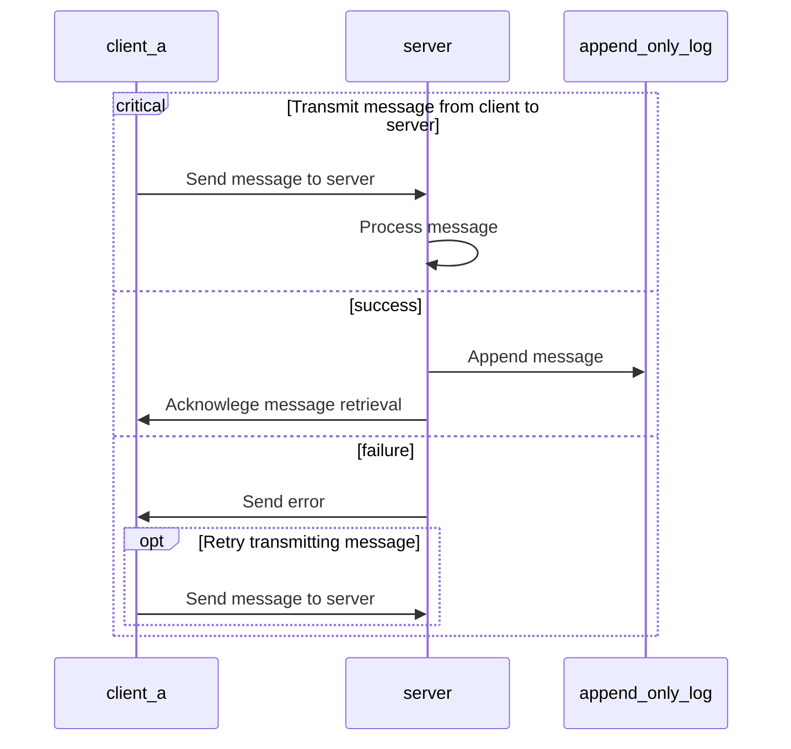
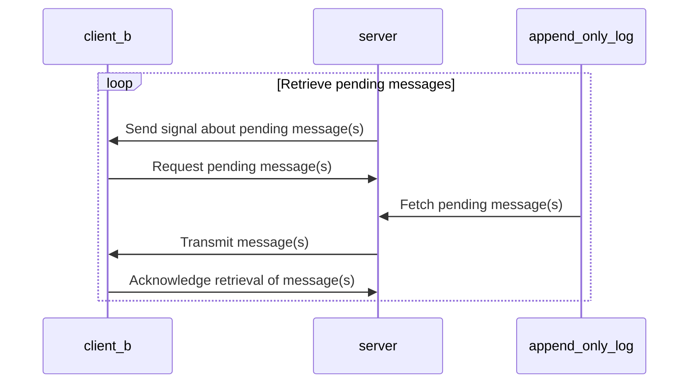
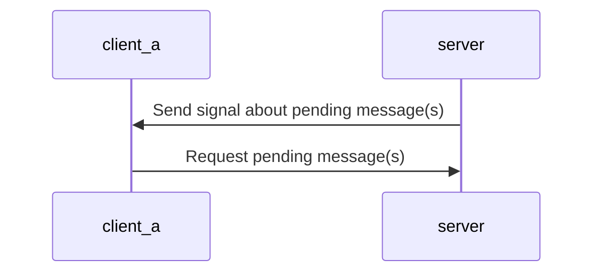
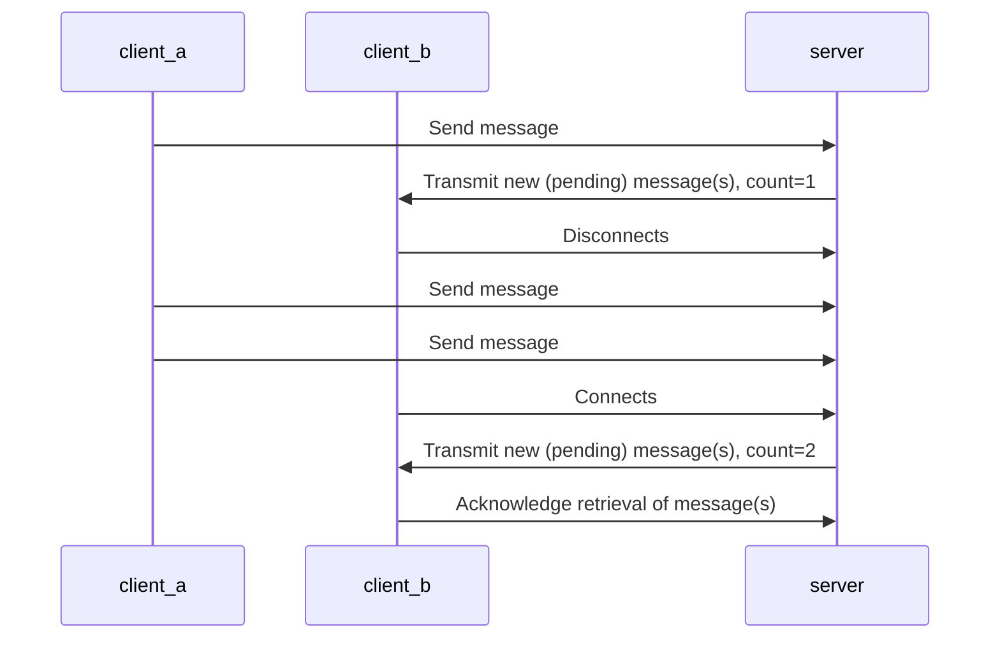
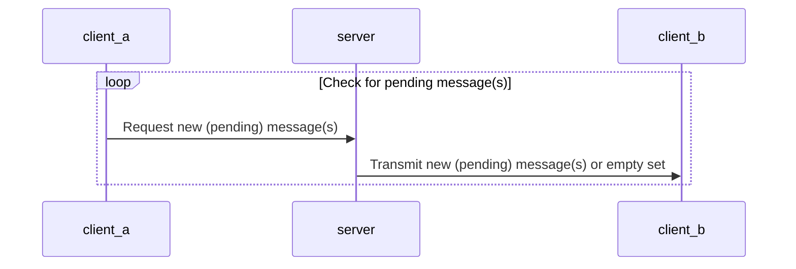
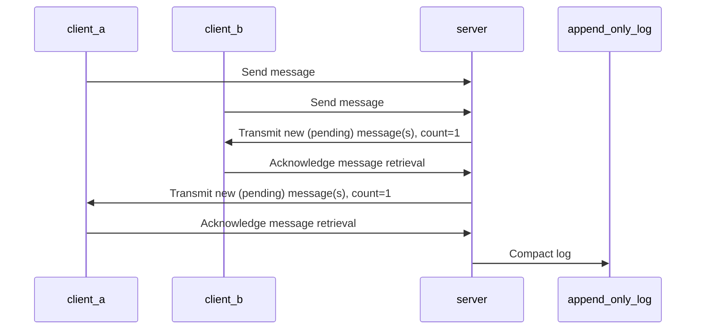
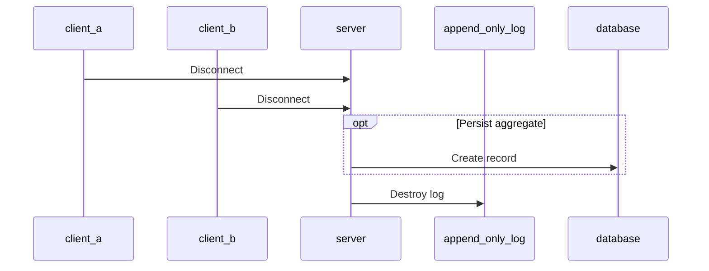

# Protocol

Documentation of the protocol implementation details, especially the parts that
ensure eventual consistency and guaranteed order.

## Requirements

* All messages (operations) are idempotent (can be retried)
* All processors (client, server) are eventually consistent
* Messages are always sent and fetched in order

## Terminology

* **Message**: The payload transmitted from a processor to another
* **Processor**: A client that can send and receive messages
* **Signal**: A small message w/o any payload but its name
* **Channel**: A group boundary for message sending and retrieval between one or more processors
* **Subscriber**: A processor that connects to a specific channel
* **Session**: A defined period of time when subscribers of a channel are present

## 1. Transmit message from client

### Example

A user edits the content of a document. The changes are transmitted to the
server.

## 2. Fetch message(s) from server

### Example

A user has previously sent a message to a channel which is subscribed to by
multiple other users. Those users receive a **signal** about a new updated being
submitted to the channel. The users therefore request a list of pending
messages from the server.

## 3. Broadcast messages

### Example

A user has previously sent a message to a channel which has multiple
subscribers. The intent of the sender is to broadcast this message to all
subscribers in the same channel.

## 4. Synchronization

### Example

A client temporarily disconnects due to a network outage. As soon as the
client connects, the server will transmit (push) pending messages to the client
to reach consistency.

## 5. Polling

### Example

A client expects to be disconnected frequently (due to an unstable connection)
from the server. The client therefore regularly request message updates with a
periodic timer.

## 6. Garbage Collection

### 6.1 Trim the log

After every known client has acknowledged the retrieval of all messages, the log
can be trimmed. This prevents the log from growing infinitely.

### 6.2 Empty channel

In case there are no subscribers left for a channel, we can safely assume that
there are no more messages to transmit (incoming and outoing) and we can destroy
the log.

#### Problems

##### 1. The last known subscriber disconnects temporarily

This can be solved by deferring the actual garbage collection of the log by a
defined timespan (e.g., 5 minutes). To achieve this, the garbage collection
process can be scheduled via a background job and canceled at all times.

##### 2. Resume a session after being disconnect for an indefinite amount of time

This can be solved by persisting the last known state (aggregate) to some
persistent storage. In case a client reconnects to the same session, the
previous state can be restored from the persistent storage, but without the
full history.

