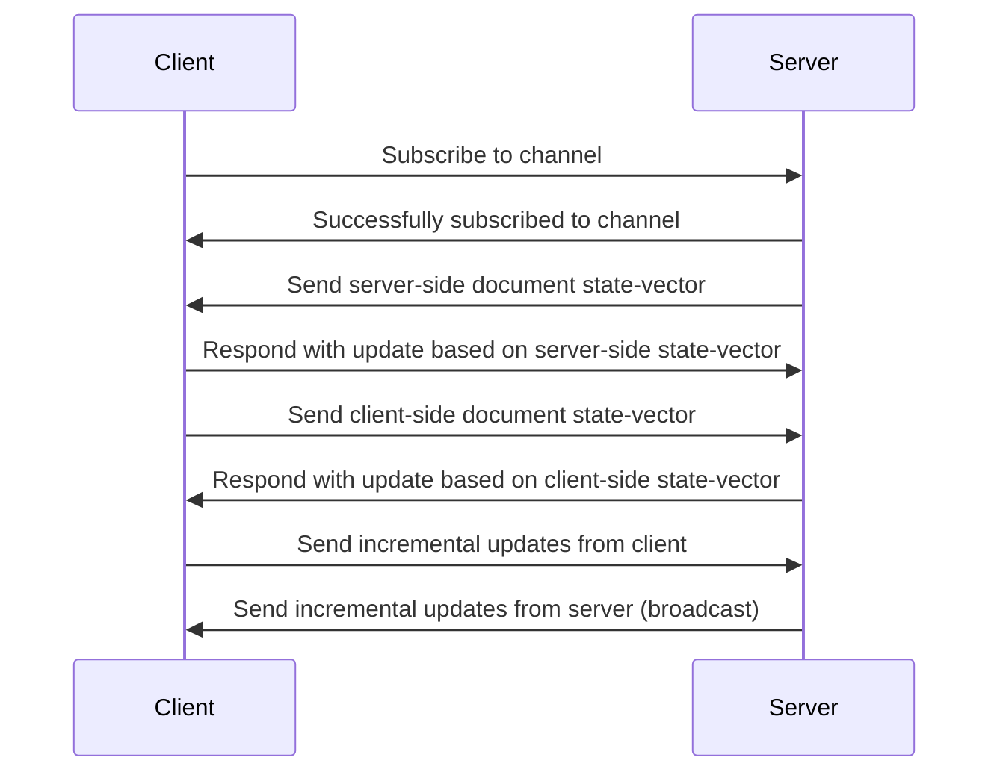

# yrb-actioncable

> An ActionCable companion for Y.js clients

## Installation

Add this line to your application's Gemfile:

```ruby
gem "y-rb_actioncable"
```

And then execute:

```bash
$ bundle
```

Or install it yourself as:

```bash
$ gem install y-rb_actioncable
```

## Usage

`yrb-actioncable` provides a module that can be used to extend the capabilities
of a regular channel with a real-time sync mechanism. `yrb-actioncable`
implements the same protocol as
[`y-websocket`](https://github.com/yjs/y-websocket/blob/master/bin/utils.js).

It will make sure that a newly connected client will be provided with the
current state and also syncs changes from the client to the server.



In order to use the above described protocol, someone can simply include the
`Sync` module. There are three methods we need to use:

1. Initiate the connection with initial sync steps: `initiate`
1. Integrate any incoming changes: `integrate`
1. Broadcast incoming updates to all clients: `sync_to`

```ruby
# app/channels/sync_channel.rb
class SyncChannel < ApplicationCable::Channel
  include Y::ActionCable::Sync

  def subscribed
    # initiate sync & subscribe to updates, with optional persistence mechanism
    sync_from("document-1")
  end

  def receive(message)
    # broadcast update to all connected clients on all servers
    sync_to("document-1", message)
  end
end
```

**⚠️ Attention:** This integration and API eventually change before the final
release. The goal for `yrb-actioncable` is simplicity and ease-of-use, and the
current implementation requires at least some knowledge about internals.

### Persistence

We can also implement a persistence mechanism with `yrb-actioncable` via hooks.
This is a quite common use case, and therefore it is relatively simple to add.

#### Load document

In order to instantiate the document with some state, `yrb-actioncable` expects
the `load` method to be called with a block that returns a full state update for
the document. Internally it just calls `Y::Doc#sync(update)`.

```ruby

class SyncChannel < ApplicationCable::Channel
  include Y::ActionCable::Sync

  def initialize(connection, identifier, params = nil)
    super
    load { |id| load_doc(id) }
  end
end
```

#### Persist document

It is usually desirable to persist updates as soon as they arrive. The method
`persist` expects a block that can process a document full state update for the
given ID.

```ruby

class SyncChannel < ApplicationCable::Channel
  include Y::ActionCable::Sync

  def subscribed
    stream_for(session, coder: ActiveSupport::JSON) do |_message|
      persist { |id, update| save_doc(id, update) }
    end
  end
end
```

#### Example implementation for `load_doc` and `save_doc`

We eventually provide storage providers that are easy to use, e.g.
[`yrb-redis`](https://github.com/y-crdt/yrb-redis), but you can also implement
your own _store_ methods.

```ruby
def load_doc(id)
    data = REDIS.get(id)
    data = data.unpack("C*") unless data.nil?
    data
end

def save_doc(id, update)
  REDIS.set(id, update.pack("C*"))
end
```

## License

The gem is available as *open source* under the terms of the
[MIT License](https://opensource.org/licenses/MIT).
