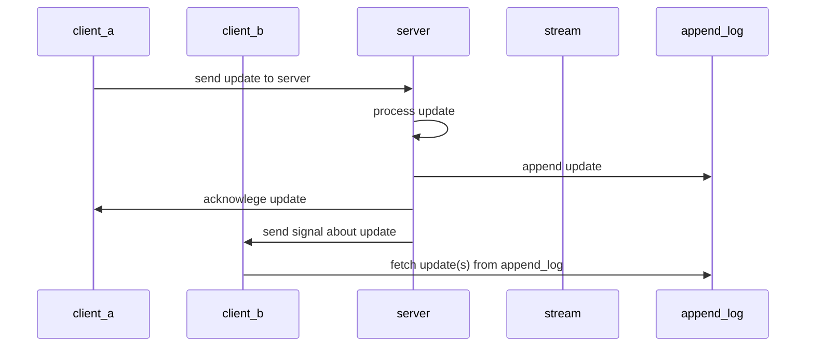

# yrb-actioncable

> An ActionCable companion for Y.js clients

This *gem* builds on top of [ActionCable](https://guides.rubyonrails.org/action_cable_overview.html),
but guarantees [at-least-once delivery](https://www.cloudcomputingpatterns.org/at_least_once_delivery/)
for all subscribed clients. *ActionCable* uses [Redis Pub/Sub](https://redis.io/docs/manual/pubsub/),
which cannot guarantee delivery under all circumstances (e.g. a temporary disconnected
client, server process crash, …).

*yrb-actioncable* achieves this by storing all sent messages into
[Redis Streams](https://redis.io/docs/data-types/streams/), and the client is
responsible for fetching messages that it hasn't received yet and must
acknowledge retrieving messages. A sending client must also receive an
*acknowledgment* response from the server, before disposing the message locally.
Otherwise, the client must send the message again (using an exponential backoff
mechanism).



## Installation

Add this line to your application's Gemfile:

```ruby
gem "yrb-actioncable"
```

And then execute:

```bash
$ bundle
```

Or install it yourself as:

```bash
$ gem install yrb-actioncable
```

## License

The gem is available as *open source* under the terms of the
[MIT License](https://opensource.org/licenses/MIT).
